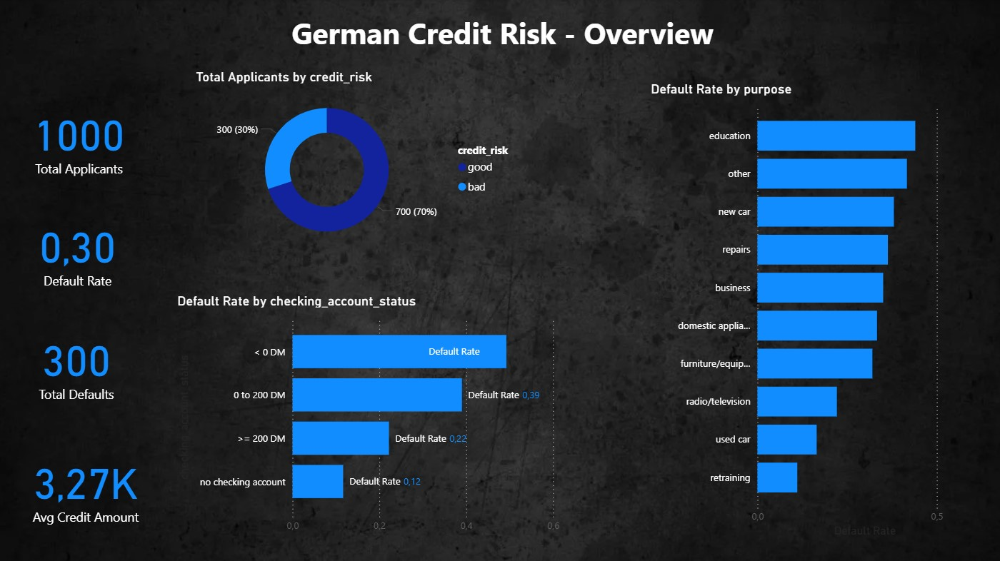
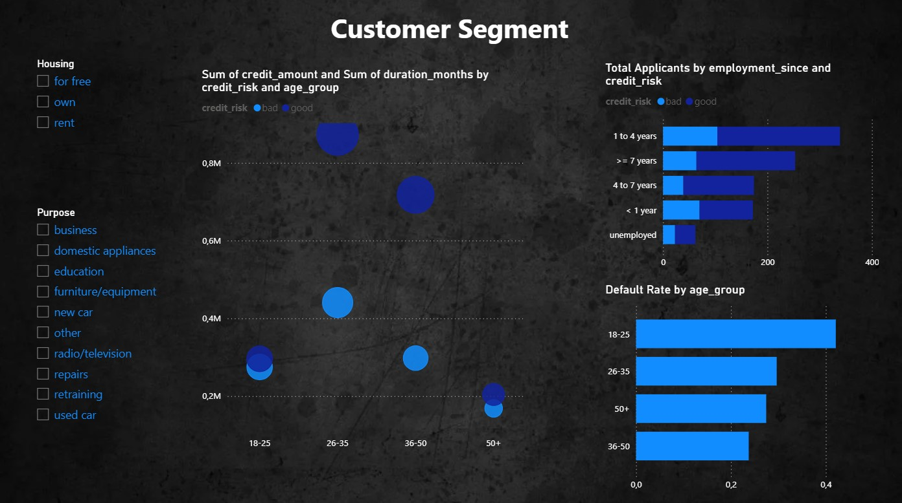
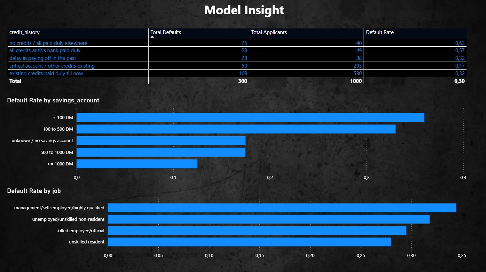

## Credit Risk Default Prediction

Kreditrisiko-Vorhersage — End-to-End Datenanalyseprojekt im deutschen Bankwesen

This project predicts whether a loan applicant is a good or bad credit risk,
using the German Credit dataset (UCI). It simulates a real-world credit risk
analytics workflow, from raw data to a stakeholder-ready dashboard.

## Business Problem

Geschäftliches Problem

Financial institutions lose billions annually to loan defaults. Early identification
of high-risk borrowers allows banks to adjust credit limits, pricing, or approval
decisions — reducing non-performing loan (NPL) ratios while maintaining portfolio growth.

Finanzinstitute verlieren jährlich Milliarden durch Kreditausfälle. Dieses Projekt
entwickelt ein Vorhersagemodell, das Kreditantragsteller in Risikoklassen einteilt
und so zur Reduzierung von notleidenden Krediten (NPL) beiträgt.

This project builds a predictive model that classifies loan applicants into risk tiers
(Low / Medium / High / Very High) using historical credit data from the UCI German
Credit dataset — a standard benchmark in German banking analytics.

## Key Results

Ergebnisse

Metric Logistic Regression XGBoost 
ROC-AUC0.73050.7871
Gini Coefficient0.46100.5743

XGBoost outperforms the baseline Logistic Regression model, achieving a Gini of 0.57 —
well above the 0.50 industry threshold used in German retail credit scoring.

## Top 3 risk predictors (via SHAP explainability):

Checking account status (Kontostand)
Credit history (Kreditgeschichte)
Loan duration & credit amount (Laufzeit & Kreditbetrag)

## Project Workflow — 6 Phases

Projektphasen

Phase Description Beschreibung Tools1 Problem definition & datasetProblemdefinition & DatensatzUCI, ucimlrepo, Python2Data engineering & SQL pipelineDatenpipeline & SQL-DatenbankSQLite, pandas3EDA & feature engineeringExplorative Analyse & Feature Engineeringmatplotlib, seaborn4ML modelling & evaluationModellierung & EvaluationXGBoost, scikit-learn, SHAP5Interactive dashboardInteraktives DashboardPower BI Desktop6Documentation & portfolioDokumentation & PortfolioGitHub, Markdown

## Dashboard Preview

Dashboard-Vorschau

The Power BI dashboard consists of 3 pages — see dashboard/credit_risk_dashboard.pdf:

Page 1 — Executive Overview: Portfolio KPIs, overall default rate, default rate by loan purpose and checking account status
Page 2 — Customer Segmentation: Risk breakdown by age group, employment, housing — with interactive slicers
Page 3 — Model Insights: Risk tier table, default probability distribution, model summary

## Dataset 
Datensatz

https://archive.ics.uci.edu/dataset/144/statlog+german+credit+data

PropertyDetailSourceUCI Machine Learning RepositoryDatasetStatlog (German Credit Data) — id=144Linkhttps://archive.ics.uci.edu/dataset/144/statlog+german+credit+dataSize1,000 loan applicants · 20 features · binary good/bad risk labelClass balance70% good risk · 30% bad riskNoteRaw categorical codes (A11, A34 etc.) decoded into readable labels in Phase 1

Der Datensatz enthält 1.000 Kreditanträge mit 20 Merkmalen aus dem deutschen Bankwesen.
Die Rohdaten wurden in Phase 1 in lesbare Labels übersetzt.

## How to Run

Ausführung

bash# 1. Clone the repository
git clone https://github.com/ambroz72/credit-risk-germany.git
cd credit-risk-germany

# 2. Install dependencies
pip install -r requirements.txt

# 3. Run notebooks in order
jupyter notebook notebooks/German_Credit_phase1.ipynb
jupyter notebook notebooks/german_Credit_phase1.2.ipynb
jupyter notebook notebooks/ML modeling & evaluatioin.ipynb

Or open each notebook directly in Google Colab using the badge at the top of each file.

## Regulatory Context

Regulatorischer Kontext — Deutscher Finanzmarkt

This project was designed with the German financial regulatory environment in mind:

DSGVO (GDPR): No personally identifiable data stored or shared
Explainable AI (XAI): SHAP values provide full feature-level transparency for every prediction — aligned with EU AI Act requirements for high-risk financial decisions
Fair lending awareness: Sensitive attributes (age, sex, foreign worker status) are documented and discussed in the modelling notebook

## Tech Stack

Technologien

CategoryToolsLanguagePython 3.10Data engineeringpandas, SQLite, ucimlrepoVisualisationmatplotlib, seabornMachine learningscikit-learn, XGBoostExplainabilitySHAPDashboardPower BI DesktopVersion controlGitHubEnvironmentGoogle Colab

Data Analyst · Python · SQL · Power BI · Machine Learning
